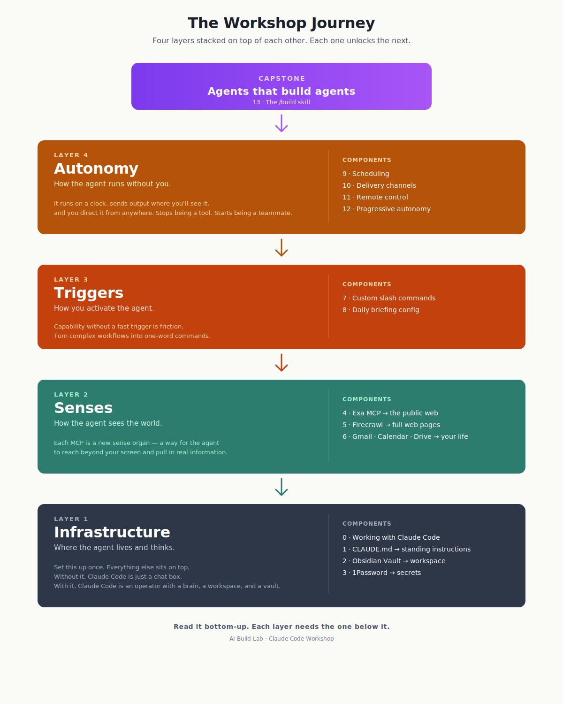

# The Workshop Journey

A map of where you are, where you're going, and why each step exists.

The workshop has 13 components. They look like a long list, but they're really four layers stacked on top of each other — each one unlocking the next. Once you see the shape, the order makes sense and you'll know exactly what each piece is doing for you.

---

## The four layers

### Layer 1 — Infrastructure
**Where the agent lives and thinks.**

You set this up once, and everything else sits on top of it. Without infrastructure, Claude Code is just a chat box. With it, Claude Code becomes an operator with a brain, a workspace, and a safe place to keep secrets.

| # | Component | What it gives you |
|---|-----------|-------------------|
| 0 | Working with Claude Code | The mental model — how Claude Code thinks and where work lives |
| 1 | CLAUDE.md | The agent's standing instructions (its long-term memory) |
| 2 | Obsidian Vault | The workspace where the agent reads and writes |
| 3 | 1Password | A safe place for the agent's keys to other tools |

**Why this comes first:** You're building a house. Infrastructure is the foundation, the walls, and the wiring. You don't put furniture in until the rooms exist.

---

### Layer 2 — Senses
**How the agent sees the world.**

Out of the box, Claude Code can only see what you type into it. MCPs change that. Each MCP is a new sense organ — a way for the agent to reach beyond your screen and pull in information from the public web, full web pages, or your personal apps.

| # | Component | What the agent can now see |
|---|-----------|----------------------------|
| 4 | Exa MCP | The public web (search) |
| 5 | Firecrawl | Full web pages (scrape) |
| 6 | Gmail / Calendar / Drive | Your inbox, your schedule, your docs |

**Why this comes second:** The infrastructure gave the agent a body. The senses give it eyes. Now it can actually look at things.

---

### Layer 3 — Triggers
**How you activate the agent.**

Now that Claude Code can see, you need a fast way to point it at something useful. Triggers turn complex workflows into one-word commands. Instead of typing a 200-word prompt every morning, you type `/morning-brief` and the agent already knows what to do.

| # | Component | What it gives you |
|---|-----------|-------------------|
| 7 | Custom Slash Commands | Saved prompts that fire on demand |
| 8 | Daily Briefing Config | The personal preferences your commands read from |

**Why this comes third:** Capability without a fast trigger is friction. Triggers turn "I could use the agent for this" into "I just did."

---

### Layer 4 — Autonomy
**How the agent runs without you.**

Up to this point, you're still the one pressing the button. Layer 4 is where the agent starts operating on its own — running on a schedule, sending output to where you'll actually see it, and letting you direct it from anywhere. This is where it stops being a tool and starts being a teammate.

| # | Component | What it gives you |
|---|-----------|-------------------|
| 9 | Scheduling | The agent runs on a clock |
| 10 | Delivery Channels | Output lands in Slack, email, or voice |
| 11 | Remote Control | You direct the agent from your phone |
| 12 | Progressive Autonomy | A safe way to scale the agent's trust |

**Why this comes fourth:** You can't safely let an agent run on its own until the first three layers are in place. Autonomy without infrastructure is chaos.

---

## Capstone — Agents that build agents

| # | Component | What it gives you |
|---|-----------|-------------------|
| 13 | The `/build` skill | An agent that can build new agents for you |

By now, you've built one full agent system from scratch. The capstone is the moment where you stop building agents one at a time and start building the thing that builds them. This is the unlock that compounds.

---

## At a glance

See [the-journey.svg](the-journey.svg) — read bottom-up. Each layer needs the one below it.

---

## Where you are right now

As you move through the workshop, come back to this page. Before each component, ask:

- **What layer is this in?**
- **What does this layer give the agent that it didn't have before?**
- **What does the next layer need from this one?**

If you can answer those three questions, you understand the system — not just the steps.
